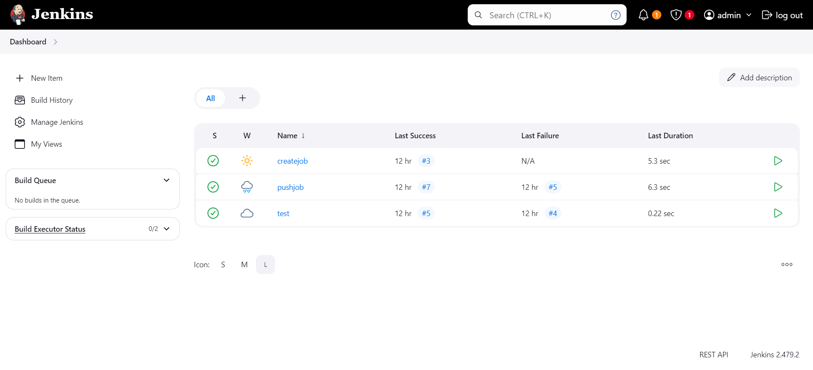
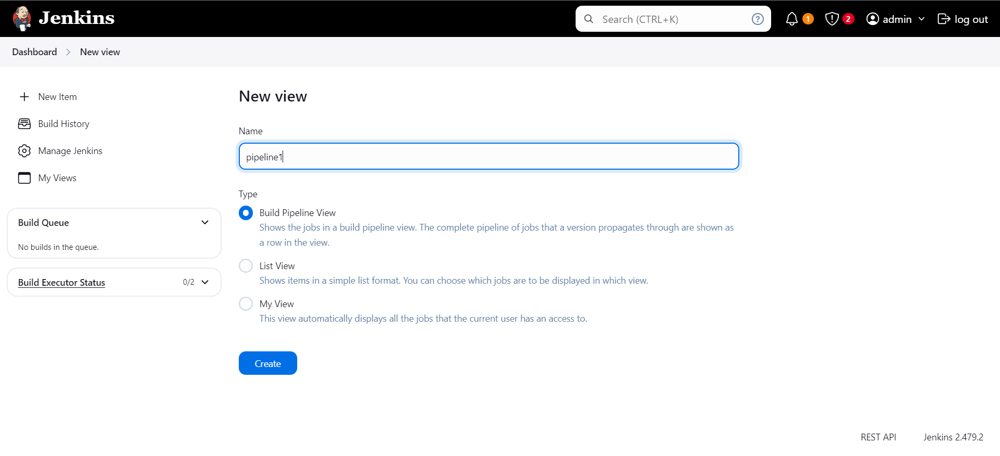
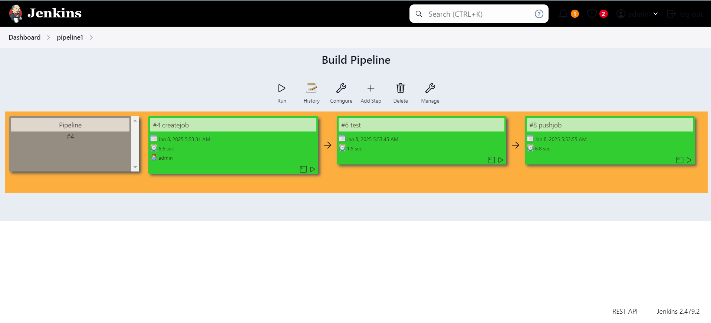
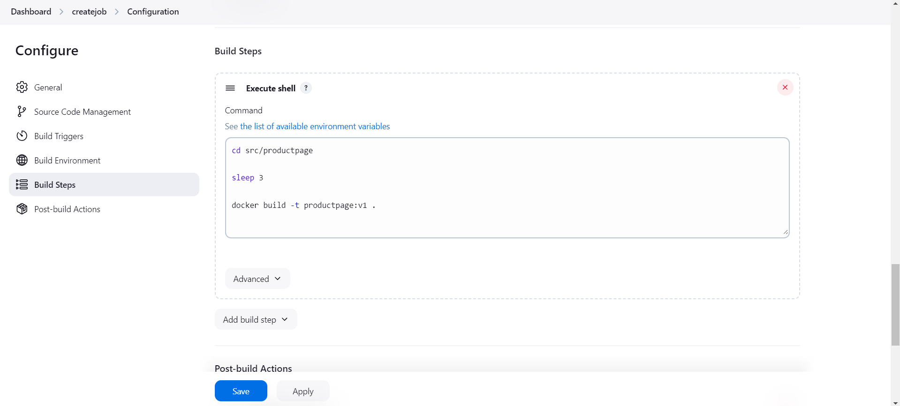
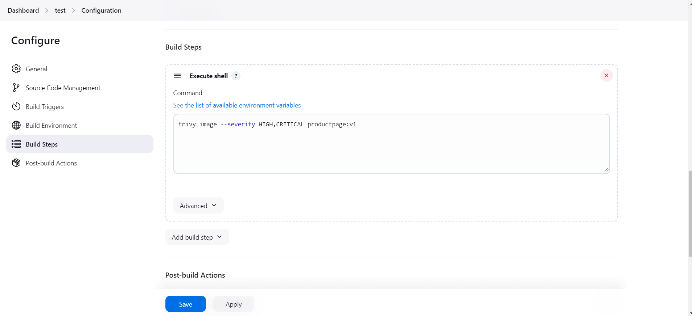
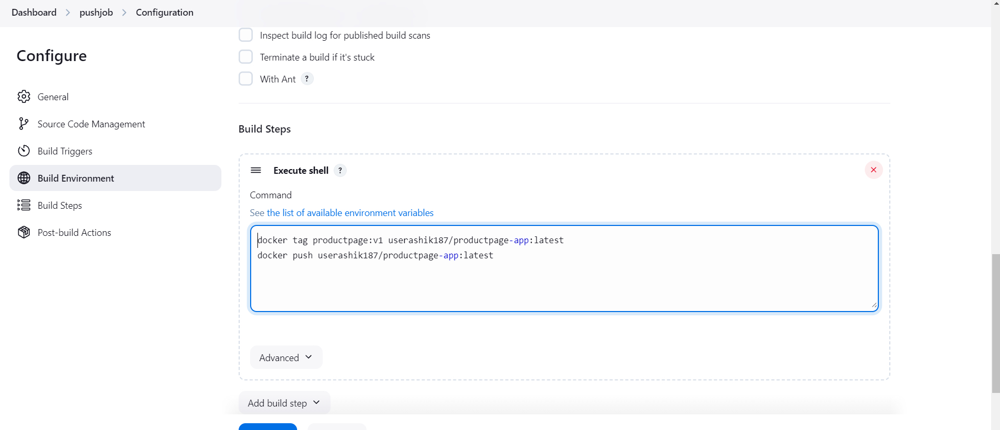
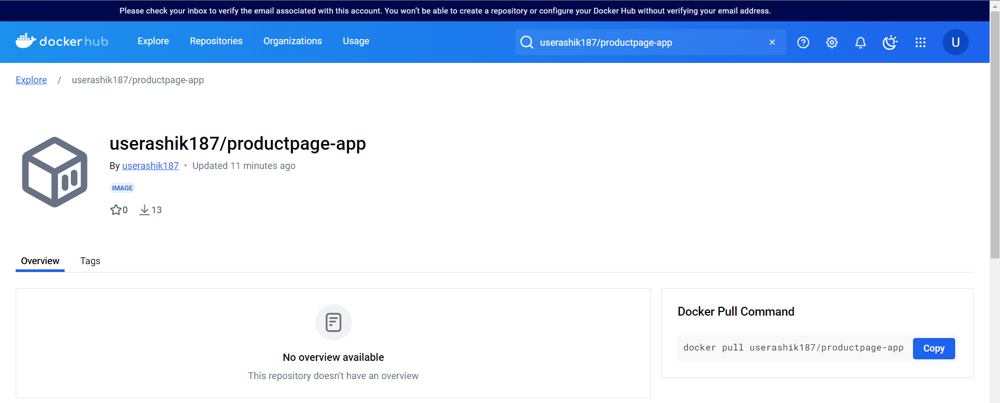

# DevOps Automation Pipeline

**End-to-end CI/CD pipeline with automated security scanning and GitOps-based deployment**

## 🎯 Overview

Automated CI/CD pipeline that builds Docker images from application source code, scans for vulnerabilities, and deploys to AWS EKS using GitOps principles. Built to demonstrate modern DevOps practices with Jenkins, Docker, Trivy, and ArgoCD.

## 🏗️ Architecture

```
GitHub (Code Push)
    ↓
Jenkins CI Pipeline (AWS EC2)
    ├─→ Job 1: Build Docker Image
    ├─→ Job 2: Trivy Security Scan (HIGH/CRITICAL)
    └─→ Job 3: Push to Docker Hub
           ↓
    ArgoCD (monitors registry)
           ↓
    AWS EKS (deploys updated image)
```

## 📸 Pipeline in Action

### Jenkins Dashboard

*Three chained Jenkins jobs forming the complete CI pipeline*

### Pipeline Execution

*Automated pipeline execution from code commit to registry push*


*Detailed view of pipeline stages and execution status*

### Individual Jobs

**Job 1: Build Docker Image**


**Job 2: Security Scanning with Trivy**


**Job 3: Push to Docker Hub**


### Deployment Result

*Successfully pushed and tagged image in Docker Hub registry*

## 🔧 Technologies Used

| Category | Tools |
|----------|-------|
| CI/CD | Jenkins (self-hosted on AWS EC2) |
| Containerization | Docker |
| Security Scanning | Trivy |
| GitOps | ArgoCD |
| Container Registry | Docker Hub |
| Orchestration | Kubernetes (AWS EKS) |
| Infrastructure | AWS (EC2, EKS) |

## ✨ Key Features

- ✅ **Automated Builds**: Triggers on GitHub code commits
- ✅ **Security First**: Trivy scans for HIGH and CRITICAL vulnerabilities before deployment
- ✅ **GitOps Workflow**: Separate CI and CD repositories following best practices
- ✅ **Zero Manual Intervention**: Fully automated pipeline from code commit to production
- ✅ **Container Registry Integration**: Automatic push to Docker Hub after successful scan

## 🚀 Pipeline Workflow

### CI Pipeline (This Repository)

1. **Trigger**: Developer pushes code to GitHub
2. **Build**: Jenkins pulls code and builds Docker image from Dockerfile
3. **Scan**: Trivy analyzes image for security vulnerabilities
4. **Gate**: Only images passing security checks proceed
5. **Push**: Verified image pushed to Docker Hub with latest tag

### CD Pipeline (Separate Repository)

6. **Monitor**: ArgoCD watches Docker Hub for new images
7. **Sync**: Automatically updates Kubernetes manifests
8. **Deploy**: Rolls out new version to AWS EKS cluster

> **Note**: The CD workflow uses ArgoCD in a [separate repository](https://github.com/Ashik-Domain/CD_Pipeline) to maintain GitOps separation of concerns.

## 📊 Jenkins Job Configuration

The pipeline consists of three chained Jenkins jobs:

### Job 1: Build_Docker_Image
- Pulls source code from [Bookinfo application](https://github.com/Ashik-Domain/Bookinfo_app.git)
- Builds Docker image using Dockerfile
- Tags image as `productpage-app`

### Job 2: Test_Docker_Image
- Runs Trivy vulnerability scanner
- Scans for HIGH and CRITICAL severity issues
- Fails pipeline if critical vulnerabilities found

### Job 3: Push_to_DockerHub
- Tags image with Docker Hub username
- Authenticates to Docker Hub
- Pushes verified image to registry
- Triggers ArgoCD sync (via GitOps)

## 🔐 Security

- **Vulnerability Scanning**: Every image scanned before deployment
- **Severity Filtering**: Only HIGH/CRITICAL issues block deployments
- **GitOps**: No direct cluster access; all changes via Git
- **Least Privilege**: Jenkins service account with minimal AWS permissions

## 📁 Repository Contents

```
.
├── Dockerfile           # Container image definition
├── README.md           # This file
└── pictures/           # Architecture diagrams and screenshots
```

## 🛠️ Local Setup

Want to replicate this pipeline? See [SETUP.md](docs/SETUP.md) for detailed installation instructions including:
- AWS EC2 setup for Jenkins
- Jenkins installation and configuration
- Docker and Trivy installation
- Jenkins job creation steps
- ArgoCD integration

## 🎓 What I Learned

- Designing multi-stage CI/CD pipelines with job chaining
- Integrating security scanning into automated workflows
- Implementing GitOps principles with separate CI/CD repos
- Managing Jenkins on AWS EC2 infrastructure
- Docker image optimization and security best practices

## 🔗 Related Projects

- [CD Pipeline with ArgoCD](https://github.com/Ashik-Domain/CD_Pipeline) - GitOps deployment to EKS
- [Bookinfo Application](https://github.com/Ashik-Domain/Bookinfo_app) - Sample microservices app

## 📝 Technical Details

**Application**: Bookinfo microservices (Product Page component)  
**Base Image**: Python-based application  
**Build Tool**: Docker  
**CI Server**: Jenkins 2.x on Amazon Linux 2  
**Scanner**: Trivy (Aqua Security)  
**Deployment Target**: AWS EKS cluster  

---

